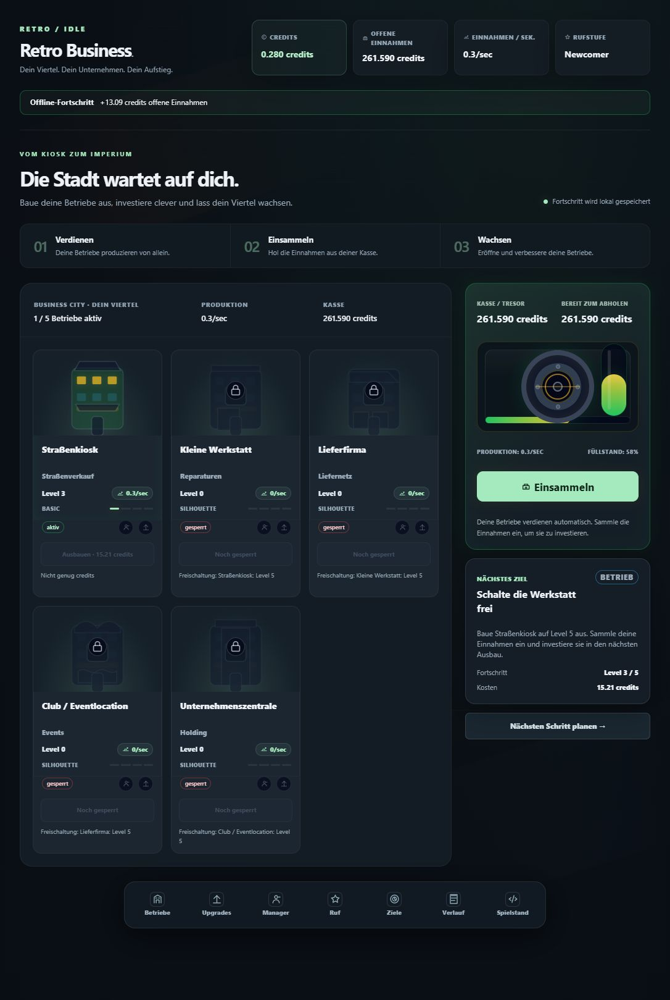

# Retro Idle

Portfolio-Arbeitsprobe von **Leon Kaiser**: ein Idle-Game mit getrennten Spielregeln, reaktiver Oberfläche und serverseitig verwaltetem Fortschritt. Das Projekt wurde iterativ mit KI-Unterstützung bei Umsetzung und Review entwickelt.

Browser-Spiel mit React, TypeScript und Vite sowie einem Node.js-/SQLite-Server. Betriebe produzieren Einnahmen, die eingesammelt und in Gebäude, Verbesserungen und Manager investiert werden. Offline-Fortschritt ist auf acht Stunden begrenzt.



## Einstieg für Code-Reviewer

Der [Code-Rundgang](docs/code-tour.md) führt durch Spielregeln, Save-Validierung und die Server-API. Die interessantesten Stellen sind die deterministischen Berechnungen in `src/game`, die Trennung zwischen Darstellung und Spielzustand sowie die Regressionstests für Offline-Fortschritt, gleichzeitige Käufe und manipulierte Sicherungen.

Der aktuelle Stand ist lokal spielbar. Dauerhafte Accounts, Zugangswiederherstellung und öffentliches Hosting sind noch offen. Eine öffentliche Live-Demo ist nicht eingerichtet.

## Start

Node.js 24 oder neuer installieren. Im Projektordner:

```sh
npm ci
npm run build
npm run server
```

Danach http://127.0.0.1:4174 öffnen. Unter PowerShell bei gesperrtem npm.ps1 stattdessen npm.cmd verwenden. Der Server erzeugt beim ersten Start seine Datenbank und einen zufälligen Verschlüsselungsschlüssel in server-data. Dieser Ordner gehört nicht in die Code-Übergabe.

Für Entwicklung zusätzlich in einem zweiten Terminal npm run dev starten. Der Vite-Server leitet API-Aufrufe an den lokalen Spielserver weiter. npm run preview zeigt nur das Frontend und bietet keine Spiel-API; zum Spielen den Node-Server benutzen.

## Prüfen

```sh
npm run check
npm run build
npm run performance
npm run balance
npm audit
npm run handoff:package
```

Das Übergabe-Werkzeug erstellt unter release einen neuen Ordner mit Quellcode, Dokumentation und SHA-256-Dateiliste. Serverdaten, Schlüssel, Logs, node_modules und dist sind ausgeschlossen.

## Projektkarte

| Pfad                           | Verantwortung                                                         |
| ------------------------------ | --------------------------------------------------------------------- |
| src/game                       | Spielregeln, Berechnungen, Fortschritt und Save-Migration             |
| src/config                     | Preise, Freischaltungen und Balancing                                 |
| src/app                        | Spielabläufe, View-Modelle und React-Controller                       |
| src/app/host                   | Server-API und isolierter Standalone-Host für Tests                   |
| src/adapters                   | Speicherverträge und lokale Testadapter                               |
| src/ui, src/styles, src/assets | Oberfläche und Darstellung                                            |
| server                         | HTTP-API, Sessions, verschlüsselte SQLite-Speicherung und Sicherungen |
| tests                          | Regressionstests für Spielregeln, Anwendung und Sicherheit            |
| scripts                        | Balancing, Performance und Übergabe-Werkzeuge                         |

Im normalen Spiel ist ausschließlich der Server für Spielstand, Zeit und Berechnung zuständig. Dateien werden mit AES-256-GCM verschlüsselt und authentifiziert. Der Browser erhält den Schlüssel nicht. Alte unverschlüsselte lokale Saves bleiben unangetastet und werden nicht automatisch übernommen.

Der aktuelle Zugang verwendet ein HttpOnly-Session-Cookie. Sicherungen gehören zu diesem Zugang, sind 30 Tage gültig und einmal importierbar. Nach gelöschten Cookies oder einem Gerätewechsel fehlt derzeit eine Anmeldung zur Wiederherstellung des Zugangs. Vor öffentlichem Betrieb sind HTTPS und ein dauerhafter Account-Zugang zu ergänzen.

Details: [Architektur](docs/architecture.md), [Sicherheit](docs/security.md), [Betrieb und Übergabe](HANDOFF.md).
